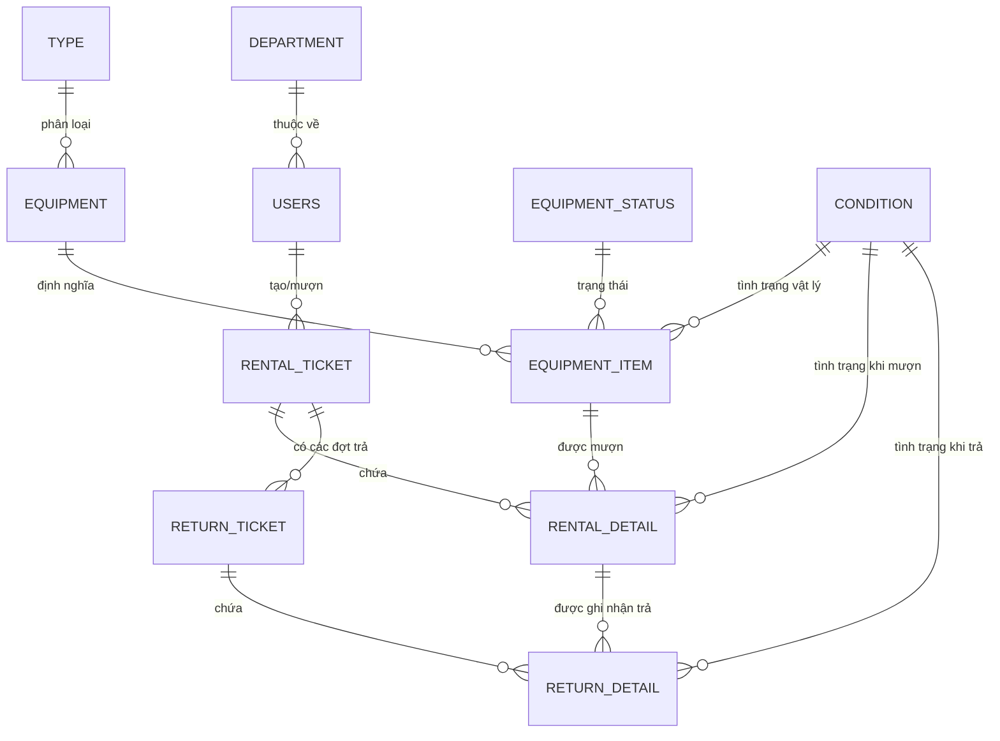

# Sơ đồ Cơ sở Dữ liệu (Database Schema)

Tài liệu này mô tả cấu trúc bảng và mối quan hệ giữa các thực thể trong hệ thống Quản lý Thiết bị CECICS.

## 1. Sơ đồ Quan hệ Thực thể (ER Diagram)

## 2. Danh sách các Bảng Chính

### 2.1. Nhóm Thiết bị (Inventory)
*   **`equipment`**: Chứa thông tin mẫu của thiết bị (Tên, mã gốc, loại).
*   **`equipment_item`**: Chứa thông tin của từng đơn vị thiết bị cụ thể (Mã barcode STT, số thứ tự, tình trạng hiện tại).
*   **`type`**: Phân loại thiết bị (mô hình, máy móc, dụng cụ...).
*   **`equipment_status`**: Trạng thái vận hành (Sẵn sàng, Đang mượn, Đang sửa chữa...).
*   **`condition`**: Tình trạng vật lý (Tốt, Hư hỏng, Cần bảo trì...).

### 2.2. Nhóm Giao dịch (Transactions)
*   **`rental_ticket`**: Thông tin chung của một phiếu mượn (Người mượn, ngày hẹn trả, ghi chú mượn).
*   **`rental_detail`**: Chi tiết từng món đồ trong phiếu mượn. Liên kết giữa `rental_ticket` và `equipment_item`.
*   **`return_ticket`**: Ghi nhận một đợt trả thiết bị (Mã phiếu trả dạng `RT-xxx-01`). Một phiếu mượn có thể có nhiều phiếu trả.
*   **`return_detail`**: Chi tiết từng món đồ được trả trong một đợt. Liên kết giữa `return_ticket` và `rental_detail`.

### 2.3. Nhóm Tổ chức (Organization)
*   **`department`**: Các bộ môn/phòng ban sử dụng thiết bị.
*   **`users`**: Thông tin nhân viên, giảng viên và kỹ thuật viên.

## 3. Quy trình Dữ liệu (Data Flow)
1.  **Mượn:** Tạo `rental_ticket` -> Tạo nhiều `rental_detail` (mỗi dòng ứng với 1 `equipment_item_id`).
2.  **Trả (Đợt 1):** Tạo `return_ticket` (ID phiếu mượn-01) -> Tạo nhiều `return_detail` liên kết với các `rental_detail_id` tương ứng.
3.  **Hoàn tất:** Khi tất cả `rental_detail` đều đã có `returned_at` (liên kết với `return_detail`), phiếu mượn được coi là hoàn thành.

---
> [!NOTE]
> Việc sử dụng bảng trung gian `rental_detail` và `return_detail` giúp hệ thống theo dõi chính xác vòng đời của từng món đồ, ngay cả khi chúng được trả thành nhiều đợt khác nhau.
